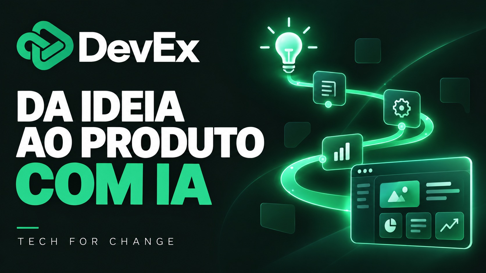
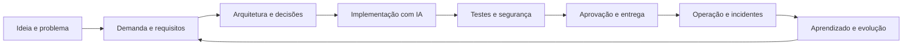
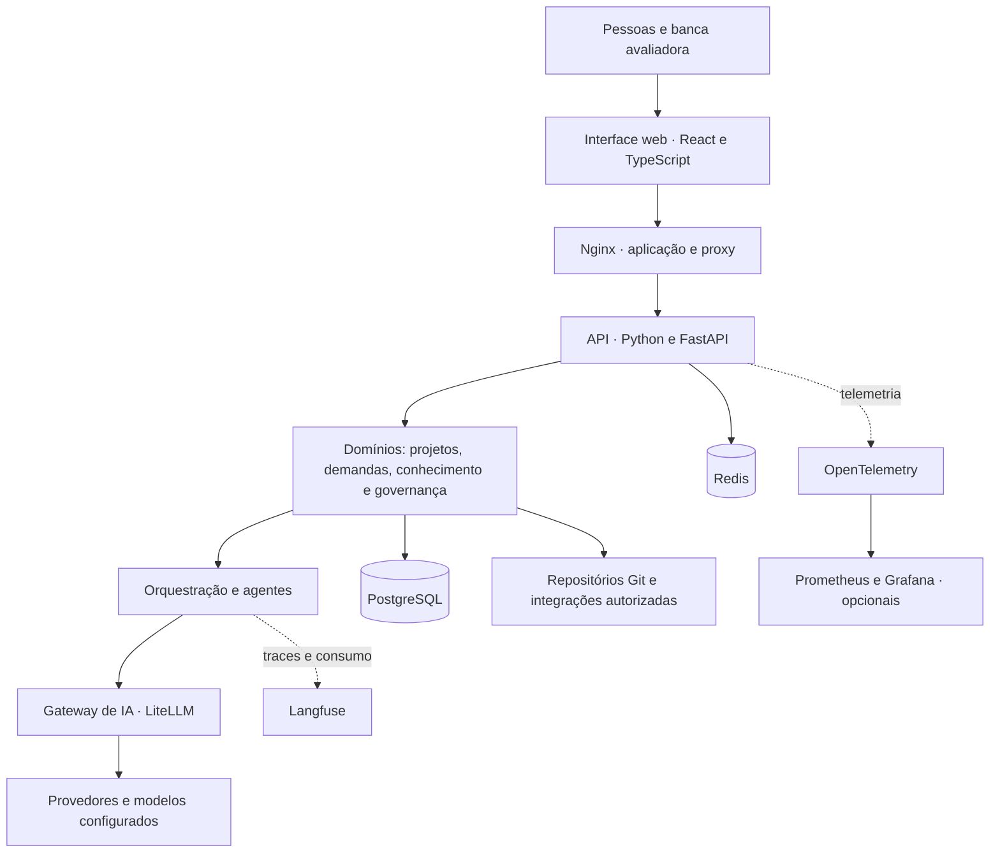

<div align="center">

# DevEx
### Da ideia ao software operando. Da capacitação à criação de oportunidades.

**Tech For Change · Empregabilidade no mundo da IA**

[**Acessar o MVP**](https://devexplataform.com.br/) · [**Assistir ao pitch**](https://youtu.be/U4EE6PbbVtI) · [**Conhecer a arquitetura**](docs/ARQUITETURA.md) · [**Roteiro para a banca**](docs/ROTEIRO-MVP.md)

[](https://youtu.be/U4EE6PbbVtI)

</div>

> **O DevEx conecta contexto, pessoas, agentes de IA e governança para conduzir o ciclo completo de desenvolvimento de software: da definição do problema à entrega e ao aprendizado em produção.**

## Acesso rápido para avaliação

| Material | Acesso |
|---|---|
| MVP online | **[devexplataform.com.br](https://devexplataform.com.br/)** |
| Vídeo do pitch | **[DevEx — Tech For Change](https://youtu.be/U4EE6PbbVtI)** |
| Participantes e matrículas | [PARTICIPANTES.txt](PARTICIPANTES.txt) |
| Arquitetura geral | [Componentes, integrações e fluxo de dados](docs/ARQUITETURA.md) |
| Tecnologias, linguagens e frameworks | [Stack e responsabilidades](docs/TECNOLOGIAS.md) |
| Orientação para uso do MVP | [Jornada de avaliação](docs/ROTEIRO-MVP.md) |
| Proposta de impacto | [Capacitação, novos negócios e reinvestimento](docs/IMPACTO.md) |
| Evidências e limites | [O que pode ser verificado e como](docs/VALIDACAO.md) |
| Origem da solução | [Base preexistente e recorte do desafio](docs/ORIGEM-E-ESCOPO.md) |

**Credenciais da banca:** fornecidas separadamente no material de entrega restrito à avaliação. A senha não é publicada neste repositório. Caso precise de acesso, entre em contato com [Rodrigo Rosa](mailto:rodrigo.grosa2011@gmail.com).

Este é o **repositório público de documentação e entrega acadêmica**. A experiência executável está no MVP indicado acima; o código da implementação não integra este pacote. Os diagramas descrevem a arquitetura da plataforma, e não serviços executáveis presentes neste repositório.

## 1. O problema que resolvemos

Ter acesso à inteligência artificial não significa ter acesso ao contexto necessário para criar software com responsabilidade.

Uma demanda passa por pessoas, documentos, repositórios e ferramentas. Quando o conhecimento fica fragmentado, a equipe precisa reconstruir a mesma informação a cada etapa. Quem está começando encontra uma barreira para contribuir; profissionais experientes se tornam pontos de dependência; decisões e custos ficam difíceis de acompanhar.

O problema aparece em quatro situações recorrentes:

- **Entrada na equipe:** aprender o sistema depende do tempo de quem já o conhece.
- **Entrega de software:** requisitos, decisões técnicas e implementação perdem conexão.
- **Uso de IA:** respostas e código podem ser produzidos sem os limites e as evidências exigidos pelo negócio.
- **Operação:** falhas e aprendizados nem sempre retornam à próxima demanda.

O DevEx organiza esse conhecimento em uma jornada compartilhada, com responsabilidades, evidências e controle de execução.

## 2. Descrição da solução

O DevEx é uma plataforma de desenvolvimento de software assistido por IA que combina **conhecimento do sistema, gestão de demandas, orquestração de agentes, artefatos técnicos, aprovações e acompanhamento operacional**.

Ao conectar um repositório autorizado, a plataforma pode construir um mapa de código, integrações, dependências e riscos. Esse contexto apoia a definição da demanda, as decisões de engenharia e a execução dos agentes. O que é produzido fica associado ao projeto e ao fluxo de trabalho.

| Capacidade | Como participa da jornada | Ganho esperado |
|---|---|---|
| Contexto de projetos e repositórios | Reúne conhecimento técnico e de negócio | Menos tempo reconstruindo informações |
| Descoberta e estruturação da demanda | Organiza problema, escopo e critérios de aceite | Mais clareza antes de implementar |
| Artefatos de SDLC | Apoia requisitos, arquitetura, decisões e evidências | Continuidade entre planejamento e execução |
| Agentes de engenharia | Apoiam análise, implementação e testes em fluxos autorizados | Redução do trabalho repetitivo |
| Governança | Permissões, contratos, aprovações e trilha de decisão | Autonomia com responsabilidade |
| Gestão de uso de IA | Acompanha modelos, consumo e custos | Visibilidade econômica da execução |
| Operação e Sentinela | Relaciona incidentes, investigação e evolução | Aprendizado após a entrega |

Os ganhos são objetivos a medir em cada implantação. A redução de prazo ou custo de um caso não constitui garantia para outros projetos.

## 3. SDLC integrado: do problema ao pós-produção

**SDLC** significa *Software Development Life Cycle*, o ciclo de vida do software. No DevEx, as etapas compartilham contexto e evidências.



**Pessoas, permissões, custos e evidências atravessam todo o ciclo.** A entrega não encerra a jornada: o comportamento do software em produção alimenta decisões futuras.

### Uma jornada prática em oito passos

1. **Criar o projeto:** registrar objetivo, contexto e responsáveis.
2. **Conectar o código:** associar um repositório autorizado e organizar o conhecimento do sistema.
3. **Definir a engenharia:** explicitar padrões, restrições e decisões técnicas.
4. **Abrir a demanda:** descrever o problema, delimitar o escopo e estabelecer critérios de aceite.
5. **Estruturar os artefatos:** produzir e revisar os documentos necessários ao fluxo.
6. **Aprovar e governar:** conferir responsáveis, evidências e permissões de execução.
7. **Implementar e testar:** executar o trabalho autorizado e preparar a revisão da mudança.
8. **Acompanhar entrega e custo:** registrar resultados e usar o aprendizado para evoluir.

A disponibilidade de cada ação depende das permissões, integrações e configurações do ambiente.

## 4. Arquitetura geral do sistema



O backend organiza responsabilidades em API, domínio, infraestrutura e componentes centrais. A persistência e as integrações apoiam a lógica de negócio. O gateway centraliza o acesso aos modelos de IA; a camada de observabilidade permite investigar execução, latência, consumo e falhas.

Os componentes acima refletem os manifestos e a documentação técnica consultados. Não representam uma auditoria da configuração ativa do endereço público. Detalhes em [ARQUITETURA.md](docs/ARQUITETURA.md).

## 5. Tecnologias, linguagens e frameworks utilizados

| Camada | Tecnologias identificadas | Responsabilidade |
|---|---|---|
| Linguagens | **Python 3.12+**, **TypeScript**, JavaScript e SQL | Backend, interface e persistência |
| Interface | **React 19**, **Vite 6**, **Tailwind CSS 4**, Radix UI | Aplicação web e componentes de interação |
| Estado e formulários | TanStack Query, Zustand, React Hook Form e Zod | Dados remotos, estado, formulários e validação |
| Visualização | React Flow, Mermaid e Dagre | Fluxos, grafos e diagramas |
| API | **FastAPI**, Uvicorn e Pydantic | Rotas, validação e contratos da aplicação |
| Persistência | **PostgreSQL 16**, SQLAlchemy, asyncpg e Alembic | Dados transacionais e migrações |
| Serviços de apoio | **Redis 7** | Cache e mecanismos de controle e coordenação |
| IA e agentes | **LiteLLM**, **LangChain**, **LangGraph**, Claude Agent SDK | Gateway, composição de fluxos e execução de agentes |
| Conhecimento do código | Graphify / graphifyy e NetworkX | Análise e representação de relações do sistema |
| Observabilidade | **Langfuse**, OpenTelemetry, Prometheus e Grafana | Traces, consumo, métricas e painéis |
| Empacotamento | **Docker**, Docker Compose e Nginx | Serviços e publicação da interface |
| Qualidade | Pytest, Vitest, Playwright, Ruff e ferramentas de análise | Testes, verificações e qualidade de código |

**Base técnica consultada:** manifestos `pyproject.toml`, `requirements.txt`, `frontend/package.json`, `docker-compose.yml` e módulos da implementação. As versões resumidas acima são as declaradas nos arquivos, não uma lista de versões detectadas no servidor. Consulte [TECNOLOGIAS.md](docs/TECNOLOGIAS.md) para detalhes e limites dessa leitura.

## 6. Governança desde a primeira decisão

A proposta de autonomia é explícita: **o agente atua dentro de um escopo autorizado; a saída do modelo, sozinha, não concede permissão de execução.**

- **Identidade e autorização:** acesso condicionado ao usuário, ao papel e ao contexto.
- **Contratos de execução:** ações delimitadas antes da execução técnica.
- **Revisões e aprovações:** fronteiras de controle antes de ações de maior impacto, conforme o fluxo habilitado.
- **Rastreabilidade:** decisões, artefatos, eventos e resultados associados à jornada.
- **Controle de uso:** acompanhamento de modelos, limites e custos de IA.
- **Operação:** investigação, correção e reversão nos fluxos aplicáveis, com registros de resultado.

A existência de políticas e mecanismos não equivale a certificação de conformidade. A configuração efetiva deve ser validada no ambiente avaliado.

## 7. Alinhamento com “Empregabilidade no mundo da IA”

**Queremos ajudar pessoas a aprender, criar produtos próprios e desenvolver novas oportunidades de trabalho e renda.**

O programa proposto une formação prática e criação de negócios. A IA participa da execução, enquanto as pessoas aprendem a definir problemas, avaliar resultados e assumir decisões.

| Etapa | Como faremos | Evidência de progresso |
|---|---|---|
| **Capacitar** | Aulas práticas, mentoria e acesso orientado ao DevEx | Participação, conclusão e avaliação de competências |
| **Criar** | Transformar um problema real em um produto mínimo viável | Produto demonstrável e critérios de aceite |
| **Validar e empreender** | Testar com potenciais clientes e desenvolver uma oferta | Feedback, testes de uso e primeiras vendas, quando ocorrerem |
| **Reinvestir** | Destinar parte da receita das vendas do DevEx à formação de novas turmas | Valores destinados, custo por participante e novas vagas |

A proposta de menor custo se apoia em automação, componentes reutilizáveis e acesso orientado à plataforma. **Percentual de reinvestimento, tamanho das turmas e orçamento ainda serão definidos e validados.** Não se promete emprego, receita ou sucesso comercial individual.

O plano de implementação e os indicadores estão em [IMPACTO.md](docs/IMPACTO.md).

## 8. Modelo de negócio e sustentabilidade

O modelo proposto combina quatro frentes:

1. **Implantação e integração:** preparação da plataforma para o contexto da organização.
2. **Licença da plataforma:** acesso recorrente à capacidade do DevEx.
3. **Sustentação e evolução:** suporte à continuidade operacional e à melhoria do uso.
4. **Soluções com IA:** aplicações para processos e necessidades específicas.

Empresas com demandas de software financiam a capacidade de entrega. Na proposta social, uma parcela da receita ajuda a custear formação, mentoria e acesso de novos participantes. A sustentabilidade deve considerar infraestrutura, consumo dos modelos, suporte e custo de capacitação.

## 9. Maturidade, validação e origem

A solução **parte de uma base preexistente ao evento**. O recorte apresentado ao Tech For Change propõe aplicar essa capacidade à empregabilidade, à formação e à criação de produtos e negócios.

Este repositório reúne a documentação de entrega, os links públicos e a identificação dos participantes. A proposta de impacto e as próximas validações são apresentadas como propostas, sem atribuir ao evento a criação integral da base técnica.

O endereço do MVP respondeu a uma consulta HTTP em **20/09/2026**. Essa verificação confirma a resposta da página inicial naquele momento; não substitui um teste funcional autenticado. Os resultados divulgados no pitch devem ser analisados junto de seus recortes e evidências, conforme [VALIDACAO.md](docs/VALIDACAO.md).

## 10. Participantes

| Participante | Matrícula |
|---|---|
| **Rodrigo Rosa** | **RM370530** |
| **Ronaldo Porto Rodrigues Filho** | **RM369789** |
| **Wellen de Freitas Silva** | **RM375652** |

Contribuições da equipe: Rodrigo Rosa conduziu produto, desenvolvimento, inteligência artificial e arquitetura corporativa; Wellen de Freitas Silva estruturou estratégia de negócios, governança e jurídico; Ronaldo Porto Rodrigues Filho estruturou planejamento financeiro, contabilidade e dados.

**Contato:** [rodrigo.grosa2011@gmail.com](mailto:rodrigo.grosa2011@gmail.com)

## 11. Organização desta entrega

```text
.
├── README.md                 # Visão geral e requisitos de documentação
├── PARTICIPANTES.txt         # Nomes e matrículas
├── assets/
│   └── devex-pitch.jpg       # Identidade visual e acesso ao vídeo
└── docs/
    ├── ARQUITETURA.md        # Componentes e fluxo técnico
    ├── TECNOLOGIAS.md        # Stack identificada
    ├── ROTEIRO-MVP.md        # Orientações para avaliação
    ├── IMPACTO.md            # Empregabilidade e sustentabilidade
    ├── VALIDACAO.md          # Evidências, indicadores e limitações
    ├── ORIGEM-E-ESCOPO.md    # Transparência sobre a base e a entrega
    └── ENTREGA.pdf           # Identificação e links para avaliação
```

### Correspondência com o item 3.5 fornecido

| Requisito visível no material do desafio | Onde encontrar |
|---|---|
| Link do repositório no PDF | [Documento de entrega](docs/ENTREGA.pdf) |
| Repositório público ou acessível à banca | Este repositório público |
| Descrição da solução no README | Seções 1, 2 e 3 |
| Tecnologias, linguagens e frameworks utilizados | Seção 5 e [detalhamento técnico](docs/TECNOLOGIAS.md) |
| Arquitetura geral do sistema | Seção 4 e [arquitetura detalhada](docs/ARQUITETURA.md) |

---

<div align="center">

**DevEx · Pessoas no comando. IA na execução. Governança em toda a jornada.**

[Conheça o MVP](https://devexplataform.com.br/) · [Assista ao pitch](https://youtu.be/U4EE6PbbVtI)

</div>
