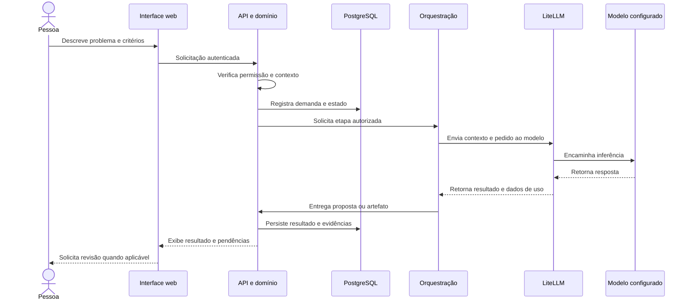

# Arquitetura geral do DevEx

[← Voltar ao README](../README.md)

## Visão e responsabilidades

A plataforma conecta uma interface web a uma API de domínio, serviços de persistência, mecanismos de orquestração e um gateway de IA. A arquitetura integra o SDLC sem transferir ao modelo a responsabilidade de definir suas próprias permissões.

| Componente | Responsabilidade | Relações principais |
|---|---|---|
| Interface web | Projetos, demandas, artefatos, aprovações e visualização de resultados | API da plataforma |
| Nginx | Entrega da aplicação web e proxy das chamadas de API | Navegador e backend |
| API FastAPI | Receber solicitações, validar contratos e aplicar autorização | Domínios e infraestrutura |
| Domínios | Regras de projetos, demandas, conhecimento, agentes, governança e operação | Persistência, jobs e integrações |
| Orquestração | Coordenar etapas e contexto de execução | Agentes, gateway e ferramentas autorizadas |
| Gateway LiteLLM | Centralizar o acesso aos modelos configurados | Provedores externos ou compatíveis |
| PostgreSQL | Persistir estado, artefatos e registros transacionais | API e serviços auxiliares |
| Redis | Apoiar cache e mecanismos de controle e coordenação | Backend e componentes associados |
| Langfuse | Observabilidade específica de IA | Traces, prompts e consumo |
| OpenTelemetry | Instrumentação e exportação de telemetria | Coletor, métricas e painéis |
| Integrações Git | Leitura de contexto e ações de engenharia autorizadas | Repositórios configurados por projeto |

## Camadas do backend

A organização consultada separa quatro responsabilidades:

- **API:** rotas, schemas, middleware e autenticação das requisições.
- **Domínio:** regras de negócio e serviços dos módulos da plataforma.
- **Infraestrutura:** clientes, adapters, persistência e dependências externas.
- **Core:** configuração e mecanismos compartilhados.

O projeto também possui migrações de banco e workers. A separação descreve a organização observada; não afirma ausência completa de acoplamento entre módulos.

## Caminho de uma demanda

A sequência é uma visão lógica. Etapas longas podem ser processadas por jobs; ela não implica que todas as chamadas ocorram em uma única requisição síncrona.

## Contexto do código

A associação de repositórios permite organizar informações sobre o sistema, seus componentes e suas relações. O módulo de conhecimento de código utiliza integração com Graphify e estruturas de grafo para apoiar a compreensão do repositório.

Esse contexto pode ser reutilizado na descoberta da demanda, na avaliação de impacto e na construção dos artefatos. A qualidade depende da versão analisada, das linguagens suportadas, da completude dos arquivos e da atualização do índice. Um mapa do código não substitui validação por quem conhece o negócio.

## Fronteiras de confiança e execução

1. **Navegador → API:** autenticação, autorização e validação da entrada.
2. **API → agentes:** contexto e objetivo delimitados pelo fluxo.
3. **Agentes → ferramentas:** permissões e contratos aplicáveis à execução.
4. **Gateway → modelos:** acesso mediado pela configuração da plataforma.
5. **Plataforma → Git ou operação:** ações externas condicionadas aos controles do fluxo habilitado.

Revisões, políticas de autonomia e flags precisam ser avaliadas em conjunto. Uma configuração que habilita uma ação altera o risco operacional e deve ter responsável definido.

## Pós-produção e Sentinela

O Sentinela relaciona incidentes, investigação, evidências e resultados de correção. A documentação consultada descreve fluxos com validação, revisão, publicação, observação e reversão, sujeitos às configurações e autorizações correspondentes.

As capacidades de manutenção do próprio DevEx não devem ser generalizadas automaticamente para qualquer sistema externo. A disponibilidade para outros repositórios depende das integrações, do escopo e do fluxo configurado.

## Implantação de referência

O empacotamento consultado utiliza Docker e Docker Compose, com serviços para frontend, API, PostgreSQL, Redis, LiteLLM, Langfuse e coletor OpenTelemetry. Prometheus e Grafana aparecem como componentes opcionais do perfil de observabilidade.

O repositório público de entrega não contém esses serviços nem oferece um comando de instalação local. A banca acessa a instância disponibilizada em [devexplataform.com.br](https://devexplataform.com.br/).

## O que esta documentação não comprova

- A topologia exata ou o dimensionamento do servidor público.
- Disponibilidade de todos os módulos para o perfil da banca.
- Capacidade de carga medida, disponibilidade contínua ou certificação de segurança.
- Que uma dependência declarada esteja ativa em todos os fluxos.

**Base de elaboração:** manifestos de aplicação e de infraestrutura e módulos da implementação consultados para esta entrega, em 20/09/2026. Credenciais, endereços internos e conteúdo corporativo não fazem parte dos diagramas.
